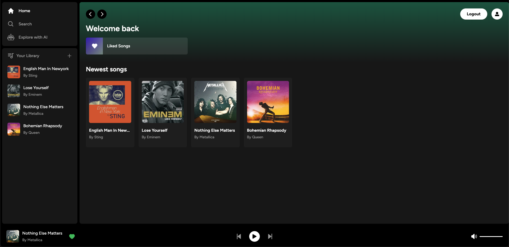
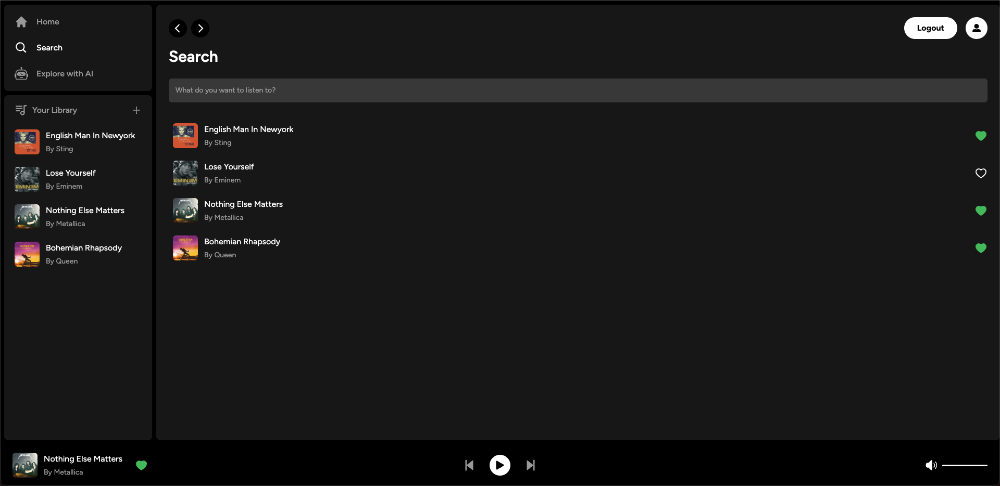
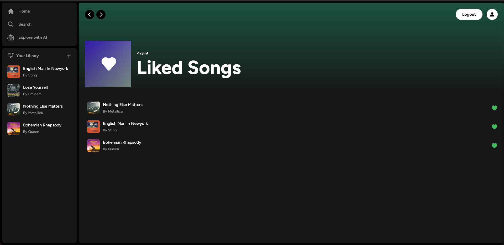
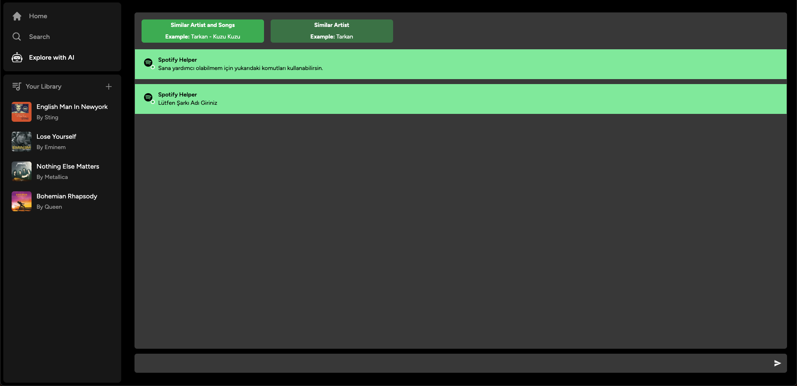

# Solidus: Web3 Music Platform

This project is a Web3 migration of a Spotify-like music streaming application, integrating Zora Coins V4 contract for tokenization. The platform combines traditional music streaming features with blockchain technology to create a decentralized music ecosystem.

## Project Overview

### Tech Stack
- **Frontend**: Next.js 14 with TypeScript and Tailwind CSS
- **Backend**: Supabase for authentication and database
- **Web3**: Zora Coins V4 for tokenization
- **Features**: Song upload, playback, search, liked songs, user authentication, and coin trading

### Key Features
- Traditional music streaming capabilities (upload, play, search, like)
- Web3 wallet integration for cryptocurrency transactions
- Artist coin creation and trading
- Real-time coin performance tracking
- Automated reward distribution system
- Multi-ownership support for platform and artists

### Core Components
1. **Song Management**
   - Upload songs with metadata
   - Create artist coins during upload
   - Manage playlists and liked songs

2. **Trading Interface**
   - Buy/Sell artist coins
   - Real-time price tracking
   - Trading activity monitoring
   - Multi-hop swap paths support

3. **Reward System**
   - Automatic distribution of rewards
   - Creator earnings (50%)
   - Platform referral rewards (30%)
   - Protocol treasury allocation (20%)

4. **Web3 Features**
   - Wallet connection
   - Coin creation with metadata
   - Pool configuration management
   - Real-time price updates

## Screenshots
  ### Home
  
    <hr>
  ### Search
  
    <hr>
  ### Liked Songs 
  
    <hr>
  ### AI helper
  


## Getting Started

First, run the development server:

```bash
npm run dev
# or
yarn dev
# or
pnpm dev
# or
bun dev
```

Open [http://localhost:3000](http://localhost:3000) with your browser to see the result.

### Prerequisites
- Node.js 18+ and npm
- Supabase account and project
- Web3 wallet (for blockchain features)
- ZORA_API_KEY for Zora Coins SDK functionality

### Environment Setup
1. Clone the repository
2. Copy `.env.example` to `.env.local` and fill in the required values:
   ```env
   # Supabase Configuration
   NEXT_PUBLIC_SUPABASE_URL=your_supabase_url
   NEXT_PUBLIC_SUPABASE_ANON_KEY=your_supabase_anon_key
   
   # Zora Configuration
   NEXT_PUBLIC_ZORA_API_KEY=your_zora_api_key
   ```
3. Install dependencies:
   ```bash
   npm install
   ```
4. Set up Supabase storage:
   - Create required storage buckets: 'songs', 'images'
   - Configure appropriate bucket policies
   - Enable file uploads with proper size limits

### Important Notes
- Ensure proper bucket permissions are set in Supabase
- Configure CORS settings if needed
- Set up appropriate file size limits
- Test Web3 features on supported networks

You can start editing the page by modifying `app/page.tsx`. The page auto-updates as you edit the file.

This project uses [`next/font`](https://nextjs.org/docs/basic-features/font-optimization) to automatically optimize and load Inter, a custom Google Font.

## Learn More

To learn more about Next.js, take a look at the following resources:

- [Next.js Documentation](https://nextjs.org/docs) - learn about Next.js features and API.
- [Learn Next.js](https://nextjs.org/learn) - an interactive Next.js tutorial.

You can check out [the Next.js GitHub repository](https://github.com/vercel/next.js/) - your feedback and contributions are welcome!

## Deploy on Vercel

The easiest way to deploy your Next.js app is to use the [Vercel Platform](https://vercel.com/new?utm_medium=default-template&filter=next.js&utm_source=create-next-app&utm_campaign=create-next-app-readme) from the creators of Next.js.

Check out our [Next.js deployment documentation](https://nextjs.org/docs/deployment) for more details.
